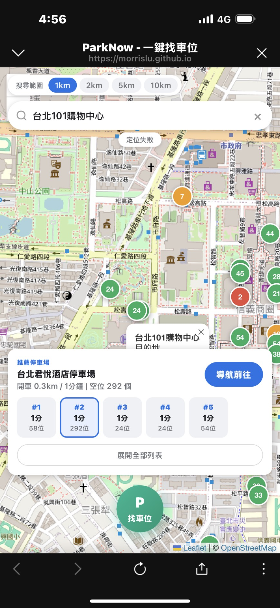
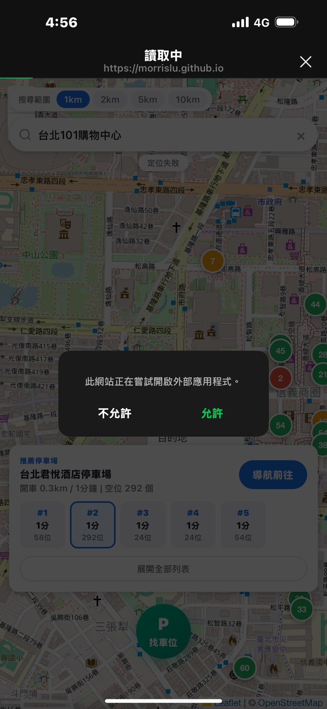
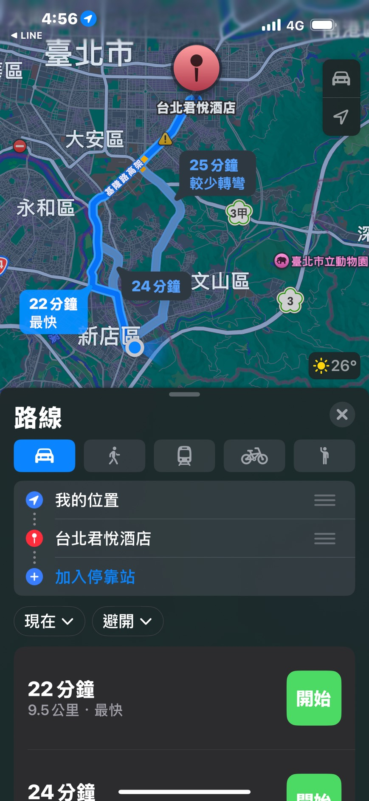
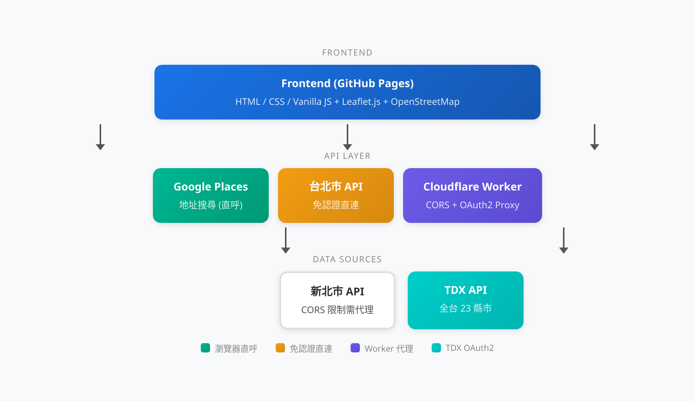

# ParkNow - 一鍵找車位

[](https://opensource.org/licenses/MIT)
[](https://morrislu.github.io/parknow/)

快速找到附近有空位的停車場，一鍵導航。全台灣 23 縣市即時停車資訊 PWA。

**Demo:** https://morrislu.github.io/parknow/

## Screenshot

| Step 1: 搜尋目的地 | Step 2: 導航確認 | Step 3: Apple Maps 導航 |
|:---:|:---:|:---:|
|  |  |  |

> 輸入「台北101」→ 自動搜尋附近停車場 → Top 5 推薦 → 一鍵導航至 Apple Maps

## 功能特色

- **全台 23 縣市** - 即時停車場空位查詢，涵蓋台北、新北、桃園、台中、台南、高雄等所有縣市
- **OSRM 開車距離排名** - 不只直線距離，透過實際路線計算 Top 5 最佳停車場
- **一鍵導航** - iOS 自動開啟 Apple Maps，Android 自動開啟 Google Maps
- **目的地搜尋** - 輸入地址或地標，自動搜尋附近停車場
- **PWA 支援** - 可安裝至手機桌面，支援離線快取
- **零框架** - 純 Vanilla JavaScript，無任何前端框架依賴

## 技術架構



| 層級 | 技術 |
|------|------|
| 前端 | HTML5 / CSS3 / Vanilla JavaScript |
| 地圖 | Leaflet.js v1.9.4 + OpenStreetMap Tiles |
| 資料來源 | 台北市 API + 新北市 API + TDX API (全台 23 縣市) |
| 代理層 | Cloudflare Worker (解決 CORS + TDX OAuth2 Token 管理) |
| 路線計算 | OSRM (Open Source Routing Machine) |
| 地址搜尋 | Google Places API (New) |

## 專案結構

```
parknow/
├── index.html              # 主頁面
├── manifest.json           # PWA 設定
├── sw.js                   # Service Worker (network-first 快取)
├── PY_server.py            # 本地開發伺服器 (Python)
├── wrangler.toml           # Cloudflare Workers 設定
├── .env.example            # 環境變數範本
├── css/
│   └── style.css           # 樣式表 (mobile-first RWD)
├── js/
│   ├── app.js              # 主程式邏輯、OSRM 排名、Top 5 推薦
│   ├── parking-service.js  # 停車場 API 整合 (台北/新北/TDX)
│   ├── location.js         # GPS 定位、城市判斷、距離計算
│   ├── map-controller.js   # Leaflet 地圖控制、標記管理
│   └── navigation.js       # 導航 (Apple Maps / Google Maps)
├── worker/
│   └── tdx-proxy.js        # Cloudflare Worker 代理 (生產環境)
├── icons/
│   ├── icon-192.png        # PWA 圖示
│   └── icon-512.png        # PWA 圖示
└── chrome畫面.png           # 截圖
```

## 快速開始 (本地開發)

### 前置需求

- Python 3.x
- 現代瀏覽器 (Chrome / Safari / Firefox)

### 步驟

```bash
# 1. Clone 專案
git clone https://github.com/Morrislu/parknow.git
cd parknow

# 2. 啟動本地伺服器
python3 PY_server.py

# 3. 開啟瀏覽器
# http://localhost:8080
```

> **免設定即可用：** 台北市 API 無需認證，可直接使用。新北市 API 透過本地伺服器代理解決 CORS。僅查詢台北/新北停車場不需要任何 API Key。

如需查詢其他縣市，需要 TDX API 憑證：

```bash
# 複製環境變數範本
cp .env.example .env

# 編輯 .env，填入 TDX 憑證
TDX_CLIENT_ID=your_client_id_here
TDX_CLIENT_SECRET=your_client_secret_here
```

## 全台灣部署指南

要部署完整版 (23 縣市) 需要以下步驟：

### Step 1: 部署前端至 GitHub Pages

1. Fork 本專案
2. 到 Repository Settings > Pages
3. Source 選擇 `main` branch，目錄選 `/ (root)`
4. 儲存後等待部署完成

### Step 2: 註冊 TDX 並取得憑證

1. 前往 [TDX 運輸資料流通服務](https://tdx.transportdata.tw/)
2. 註冊帳號並登入
3. 建立應用程式，取得 `Client ID` 和 `Client Secret`

> TDX 提供免費額度，一般個人使用足夠。

### Step 3: 部署 Cloudflare Worker

```bash
# 安裝 Wrangler CLI
npm install -g wrangler

# 登入 Cloudflare
wrangler login

# 設定 Secrets
wrangler secret put TDX_CLIENT_ID
wrangler secret put TDX_CLIENT_SECRET

# 部署 Worker
wrangler deploy
```

### Step 4: 更新 Worker URL

部署完成後，Cloudflare 會提供 Worker URL (例如 `https://parknow.your-name.workers.dev`)。

編輯 `js/parking-service.js`，更新 `CF_WORKER_URL`：

```javascript
const CF_WORKER_URL = 'https://parknow.your-name.workers.dev';
```

提交變更並推送至 GitHub，GitHub Pages 會自動更新。

## API 來源

| API | 用途 | 認證 | 費用 |
|-----|------|------|------|
| [台北市停車資訊](https://tcgbusfs.blob.core.windows.net/blobtcmsv/TCMSV_alldesc.json) | 台北市停車場資料 + 即時空位 | 無需認證 | 免費 |
| [新北市停車資訊](https://data.ntpc.gov.tw/) | 新北市停車場資料 + 即時空位 | 無需認證 (需 CORS 代理) | 免費 |
| [TDX 運輸資料](https://tdx.transportdata.tw/) | 全台 23 縣市停車場 | OAuth2 Client Credentials | 免費額度 |
| [OSRM](https://router.project-osrm.org/) | 開車路線距離計算 | 無需認證 | 免費 |
| [Google Places API](https://developers.google.com/maps/documentation/places/web-service) | 地址搜尋 (Autocomplete + Details) | API Key (網站限制) | 免費額度 |
| [Nominatim](https://nominatim.openstreetmap.org/) | 反向地理編碼 (城市判斷) | 無需認證 | 免費 |
| [OpenStreetMap](https://www.openstreetmap.org/) | 地圖圖磚 | 無需認證 | 免費 |

## 支援城市

全台灣 23 縣市完整支援：

| | | | |
|---|---|---|---|
| 台北市 | 新北市 | 基隆市 | 桃園市 |
| 新竹市 | 新竹縣 | 苗栗縣 | 台中市 |
| 彰化縣 | 南投縣 | 雲林縣 | 嘉義市 |
| 嘉義縣 | 台南市 | 高雄市 | 屏東縣 |
| 宜蘭縣 | 花蓮縣 | 台東縣 | 澎湖縣 |
| 金門縣 | 連江縣 | | |

## License

[MIT License](LICENSE) - Copyright (c) 2026 Morrislu
